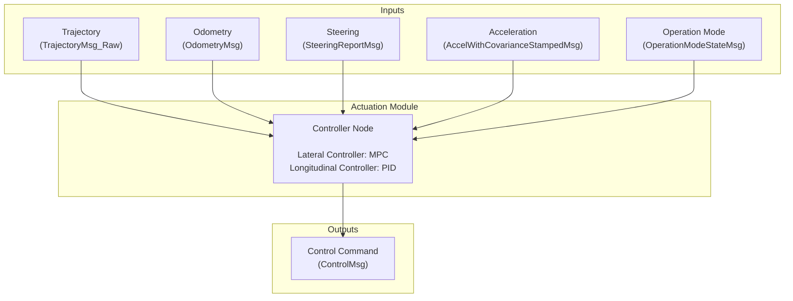

<!--
# Copyright (c) 2024-2025, Arm Limited.
#
# SPDX-License-Identifier: Apache-2.0
-->

# ARM Safety Island - Autoware Actuation Module

   

    The ARM Safety Island is responsible for generating the control commands 
    for the vehicle actuators in autoware-compatible format, and publishing 
    them to the DDS bus. 
    
    The implementation does not require any changes to the Autoware codebase, 
    and can be used as a standalone component.

### Workflow

## Main Components

| Component | Version |
|--------------|---------------|
| Zephyr RTOS  | [3.6.0](https://github.com/zephyrproject-rtos/zephyr/commit/6aeb7a2b96c2b212a34f00c0ad3862ac19e826e8) |
| CycloneDDS  | [0.11.x](https://github.com/eclipse-cyclonedds/cyclonedds/commit/7c253ad3c4461b10dc4cac36a257b097802cd043) |
| Autoware    | [2025.02](https://github.com/autowarefoundation/autoware/tree/2025.02) |
| Autoware.Universe | [0.40.0](https://github.com/autowarefoundation/autoware.universe/tree/0.40.0) |
| Autoware.msgs | [1.3.0](https://github.com/autowarefoundation/autoware_msgs/tree/1.3.0) |

## Autoware Components

| Component | Description |
|-----------|---------|
| autoware_msgs | Autoware Messages |
| autoware_osqp_interface | OSQP Interface |
| autoware_universe_utils | Universe Utils |
| autoware_motion_utils | Motion Utils |
| autoware_interpolation | Interpolation Utils |
| autoware_vehicle_info_utils | Vehicle Info Utils |
| autoware_trajectory_follower_base | Trajectory Follower Base |
| autoware_mpc_lateral_controller | MPC Lateral Controller |
| autoware_pid_longitudinal_controller | PID Longitudinal Controller |
| autoware_trajectory_follower_node | Trajectory Follower Node |

## Getting Started

Go to the [documentation](https://oguzkaganozt.github.io/actuation_porting/) for details.