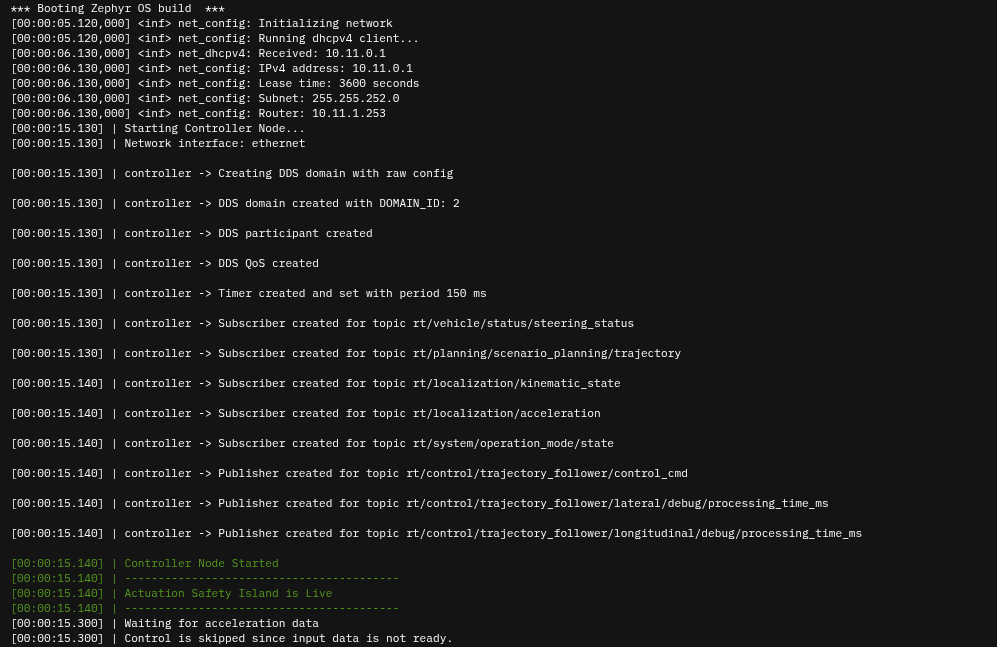

..
 # Copyright (c) 2024, Arm Limited.
 #
 # SPDX-License-Identifier: Apache-2.0

.. |Cortex(R)-R82| replace::
  Cortex\ :sup:`®`-R82

.. _Cortex(R)-R82:
  https://developer.arm.com/Processors/Cortex-R82

###############################
Arm Virtual Hardware deployment
###############################

************
Introduction
************

This page documents the steps needed to run the Safety Island Actuation Module
with a simulated Autoware environment on an `AWS EC2 <https://aws.amazon.com/ec2/>`_
instance, connected over a Virtual Private Network (VPN) to the Safety
Island on an `Arm Virtual Hardware
<https://www.arm.com/products/development-tools/simulation/virtual-hardware>`_
(AVH) |Cortex(R)-R82|_ based board.

.. note::

  All command examples on this page from the HTML document format can be copied
  by clicking the copy button.
  In the PDF document format, be aware that special characters are added when
  lines get wrapped.

************************
Zephyr application build
************************

On a local machine (validated with Ubuntu 22.04), a suitable environment is
needed to build the Zephyr application. Please follow the official
`Zephyr documentation <https://docs.zephyrproject.org/latest/develop/getting_started/index.html>`__
to set up the build environment and install the Zephyr SDK.

Clone the repository and its submodules:

.. code-block:: console

  $ git clone https://github.com/oguzkaganozt/actuation_porting.git
  $ cd actuation_porting
  $ git submodule update --init --recursive

Launch the development container:

.. code-block:: console

  $ ./launch-dev-container.sh

Inside the development container, build the Zephyr application for the AVH target:

.. code-block:: console

  $ ./build.sh

The resulting Zephyr binary is located at
``build/actuation_module/zephyr/zephyr.elf``

***********************
Virtual machines launch
***********************

AVH launch (Safety Island)
==========

Deploy and connect to the Zephyr application on the AVH instance:

.. note::

  You can deploy and connect to the ARM instance on AVH both using WEB UI or the avh.py script.
  The script is recommended and more convenient for automation and scripting. 
  
  In order to use the script, you need to have the ``.env`` file set up in the root directory of the repository.
  You can use the ``template.env`` file as a template. 

  - If you are using staging environment, you can leave ``AVH_API_ENDPOINT`` as it is or for production environment, you need to change the ``AVH_API_ENDPOINT`` to https://app.avh.arm.com/api or another production environment endpoint.
  - You can find your ``AVH_API_TOKEN`` by going to Corellium dashboard then navigate to profile/api.
  - You can find your ``AVH_PROJECT_NAME`` by going to Corellium dashboard then navigate to projects.
  - You can choose any name for ``AVH_INSTANCE_NAME``.
  - This application specifically designed for **aem8r64-lan9c111** flavor. So changing the ``AVH_INSTANCE_FLAVOR`` is not recommended.

Option 1: Using the script
=========================

.. code-block:: console

  $ ./avh.py --deploy --ssh

Option 2: Using the WEB UI
==========================

Follow the instructions of the `Arm Virtual Hardware User Guide
<https://developer.arm.com/documentation/107660/0600/Overview/Access-and-Costs?lang=en>`_
in order to create an account.

Create a Cortex\ :sup:`®`-R82 device with LAN91C111 networking, upload the
previously compiled ``zephyr.elf`` file as the custom firmware and start the
device. See the `Upload Firmware in Web UI
<https://developer.arm.com/documentation/107660/0600/Device-Firmware/Upload-Firmware-in-Web-UI?lang=en>`_
page for details.

Device boot logs
==================

You should see the logs when the device boots up in the console tab.

EC2 launch (Autoware Main Compute)
==========

If needed, follow the `Create Your AWS Account
<https://aws.amazon.com/getting-started/guides/setup-environment/module-one/>`_
tutorial in order to create an AWS account.

If needed, read the `Launch an instance using the new launch instance wizard
<https://docs.aws.amazon.com/AWSEC2/latest/UserGuide/ec2-launch-instance-wizard.html?icmpid=docs_ec2_console>`_
page in order to learn how to create and configure an AWS EC2 instance.

Launch an instance:

- running Ubuntu Server 22.04 on a 64-bit Arm architecture

- with 8 vCPUs and 16GB of RAM on Graviton3 (type "m7g.2xlarge")

- selecting or creating a key pair for login

- enabling "Auto-assign a public IP" and allowing SSH traffic from a sensible
  range of IP addresses

- configuring 32GB of gp3 storage

**************
Running the Demo
**************

Read the `Connect to your Linux instance using an SSH client
<https://docs.aws.amazon.com/AWSEC2/latest/UserGuide/connect-linux-inst-ssh.html#connect-linux-inst-sshClient>`_
paragraph in order to find the SSH command to connect to the instance.

Inside the EC2 instance, install Docker engine. Follow the official
`Install Docker Engine <https://docs.docker.com/engine/install/ubuntu/>`_ instructions.

VPN connection
==============

Inside the devcontainer, you can use the script to directly connect to the Corellium VPN
by running the following command:

.. code-block:: console

  $ ./avh.py --vpn-connect
  
If you check with ``ip a`` command, you should see the ``tap0`` interface created.

**Or Manually:**
Inside the EC2 instance, you can connect to the Corellium VPN by following the steps below:
On the AVH website, in the "Connect" tab of the previously created device, use
the "Download OVPN File" button to download the VPN configuration file.

Copy the repository and the OVPN file to the EC2 instance using SCP. If needed,
follow the `Transfer files to Linux instances using an SCP client
<https://docs.aws.amazon.com/AWSEC2/latest/UserGuide/connect-linux-inst-ssh.html#linux-file-transfer-scp>`_
paragraph for instructions on how to do that. The following steps assume that
the repository is in ``~/actuation_porting`` and ``~/avh.ovpn`` is the destination
path for the configuration file.

Install the OpenVPN package and use the VPN configuration
file to connect to the local network of the Safety Island, leaving the VPN
client running in the background:

.. code-block:: console

  $ sudo apt update
  $ sudo apt install --no-install-recommends openvpn
  $ sudo -b openvpn --config ~/avh.ovpn

The expected output ends with:

.. code-block:: text

  [...] TUN/TAP device tap0 opened
  [...] net_iface_mtu_set: mtu 1500 for tap0
  [...] net_iface_up: set tap0 up
  [...] net_addr_v4_add: X.X.X.X/X dev tap0
  [...] Initialization Sequence Completed

.. warning::

  If the name of the interface created is not "tap0", update the CycloneDDS
  configuration file at ``demo/cyclonedds.xml`` to reflect it.

Launching Autoware
===================

Navigate to the `demo` directory and start the Autoware container using
Docker Compose:

.. code-block:: console

  $ cd ~/actuation_porting/demo
  $ docker compose up

This will start the **Autoware without actuation pipeline**, which will then connect to
the **ARM Safety Island Actuation Module** running on the AVH instance through DDS over the VPN.

Launching the simulation
========================

1. After containers are running, you can open the visualizer from the link that is given in the logs OR with the link http://<ec2-instance-public-ip>:6080/vnc.html?resize=scale&password=openadkit&autoconnect=true
2. Set the initial pose for the ego vehicle by clicking the "2D Pose Estimate" button in the visualizer.
3. Set the goal pose for the ego vehicle by clicking the "2D Goal Pose" button in the visualizer.
4. Click the "Auto" button on "Operation Mode" tab in the visualizer.

You can follow the simulation tutorial in the `Autoware documentation <https://autowarefoundation.github.io/autoware-documentation/main/tutorials/ad-hoc-simulation/planning-simulation/>`_.
